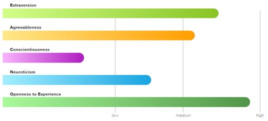

<html>
<head>
 <link rel="stylesheet" href="3style.css">
</head>
<body>
 <ul>
 <li><a href="https://rmitstudent-assessment.github.io/My-Profile/">Home</a></li>
 <li><a href="https://rmitstudent-assessment.github.io/My-Profile/interestsinit">Interests in IT</a></li>
 <li><a href="https://rmitstudent-assessment.github.io/My-Profile/idealjob">Ideal Job</a></li>
 <li><a href="https://rmitstudent-assessment.github.io/My-Profile/personalprofile">Personal Profile</a></li>
 <li><a href="https://rmitstudent-assessment.github.io/My-Profile/projectidea">Project Idea</a></li>
</ul>
 <header>
<h1>Personal Profile</h1>
             </header>

  
  
Results of Myers-Briggs Test

 

  
  
Results of Learning Style Test

 

  
  
Results of Big Five Personality Test

          

